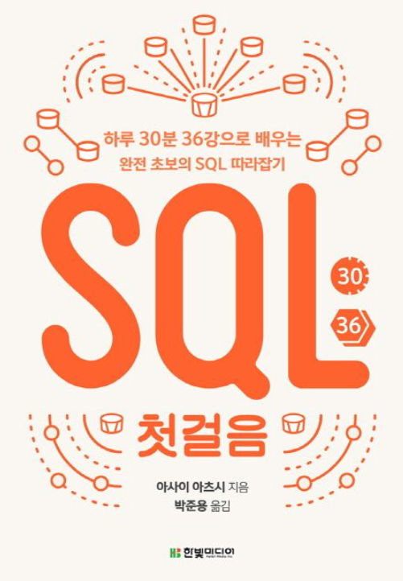
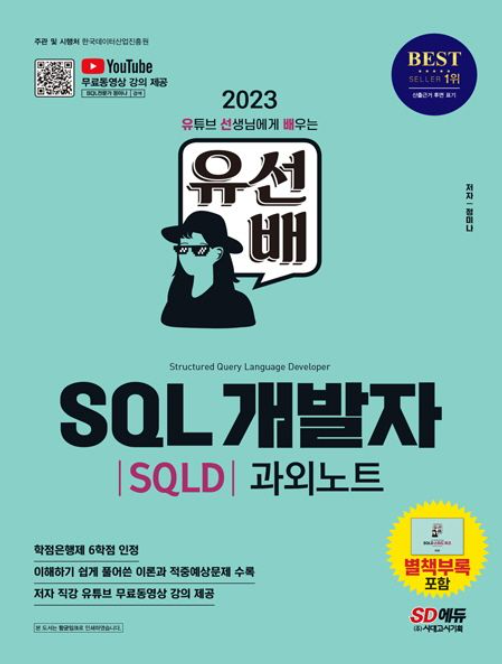

# 📓Structed-Query-Diary

# 데이터분석가에게 SQL언어가 중요한 이유
- 데이터 수집에서부터 추출/정제/가공 단계가 이루어져야 분석을 위해 사용할 수 있는 데이터가 필요
- 엑셀로도 진행 할 수 있지만 대용량 데이터를 다루기 위해서는 SQL이라는 도구를 활용해야 함

# DB관리 시스템의 종류

# 학습 주기
- 하루에 30분/주3회 이상 커밋

# 학습 툴
- MySQL과 Oracle DB를 사용하여 학습
- SQL기초에 대한 강의 내용 학습

# 학습 교재

  <table>
    <tr>
      <td></td>
      <td></td>
    </tr>
    <tr>
      <td align="center"><a href="https://product.kyobobook.co.kr/detail/S000001057649">SQL 첫걸음</a></td>
      <td align="center"><a href="https://product.kyobobook.co.kr/detail/S000200050101">SQL개발자 SQLD과외노트</a></td>
    </tr>
  </table>

  
# 레파지토리 구조
📂 SQL 첫걸음(MySQL사용) 
├── Part1_데이터베이스와SQL 
│   ├── Chapter1_데이터베이스 
│   │   ├── 01_데이터베이스 
│   │   ├── 02_DB와DBMS 
│   │   └── 03_SQL언어 
│   ├── Chapter2_다양한데이터베이스 
│   │   ├── 01_데이터베이스종류 
│   │   ├── 02_RDBMS시스템 
│   │   ├── 03_데이터베이스제품 
│   │   └── 04_SQL방언과표준화 
│   └── Chapter3_데이터베이스서버 
│       ├── 01_클라이언트서버모델 
│       ├── 02_웹애플리케이션구조 
│       └── 03_MySQL서버와클라이언트 
├── Part2_테이블에서데이터검색 
│   ├── Chapter4_HelloWorld실행하기 
│   │   ├── 01_SELECT문실행 
│   │   ├── 02_SELECT명령구문 
│   │   ├── 03_예약어와객체명 
│   │   ├── 04_HelloWorld실행결과 
│   │   └── 05_값이없는데이터NULL 
│   ├── Chapter5_테이블구조참조하기 
│   │   └── 01_DESC명령 
│   ├── Chapter6_검색조건지정하기 
│   │   ├── 01_SELECT구열지정 
│   │   ├── 02_WHERE구행지정 
│   │   ├── 03_문자열형상수 
│   │   ├── 04_NULL값검색 
│   │   └── 05_비교연산자 
│   └── ... 
└── ... 

📂 SQL개발자_SQLD과외노트(Oracle사용) 
├── Part1_데이터모델링의이해 
│   ├── Chapter1_데이터모델링의이해 
│   │   ├── 01_데이터모델링의이해 
│   │   ├── 02_엔티티 
│   │   ├── 03_속성 
│   │   ├── 04_관계 
│   │   └── 05_식별자 
│   └── Chapter2_데이터모델링SQL 
│       ├── 01_정규화 
│       ├── 02_반정규화 
│       └── 03_트랜잭션 
├── Part2_SQL기본과활용 
│   ├── Chapter1_SQL기본 
│   │   ├── 01_관계형데이터베이스개요 
│   │   ├── 02_SELECT문 
│   │   ├── 03_함수 
│   │   ├── 04_WHERE절 
│   │   ├── 05_GROUPBY절_HAVING절 
│   │   ├── 06_ORDERBY절 
│   │   └── 07_JOIN 
│   └── Chapter2_SQL활용 
│       ├── 01_서브쿼리 
│       ├── 02_뷰 
│       ├── 03_집합연산자 
│       ├── 04_인덱스 
│       ├── 05_데이터유형 
│       ├── 06_Top-N쿼리 
│       ├── 07_셀프조인 
│       └── 08_계층쿼리 
└── Part3_쿼리구문 
    ├── Chapter1_DML 
    ├── Chapter2_DCL 
    ├── Chapter3_DDL 
    └── Chapter4_TCL 

# 💻커밋 규칙
- INSERT/UPDATE/DELETE : file name : description of what and why
